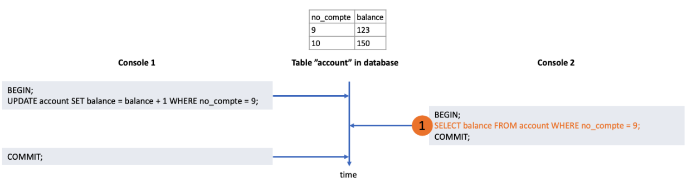
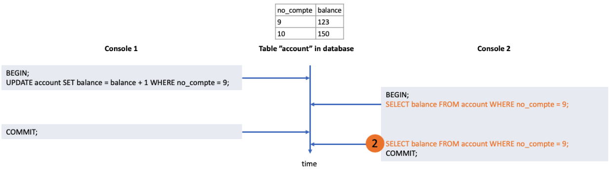
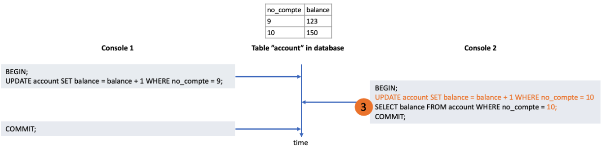
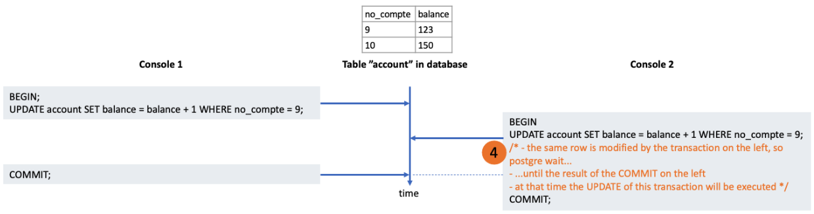
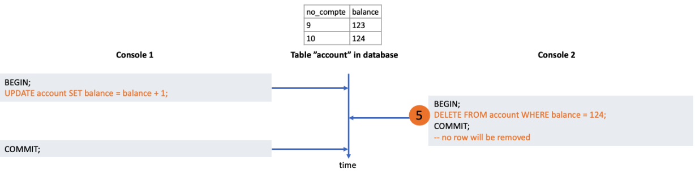
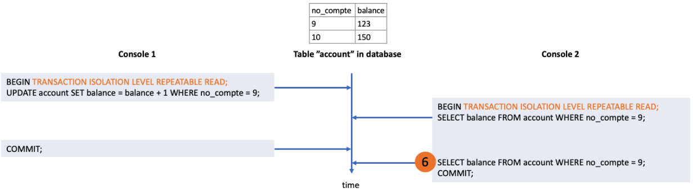
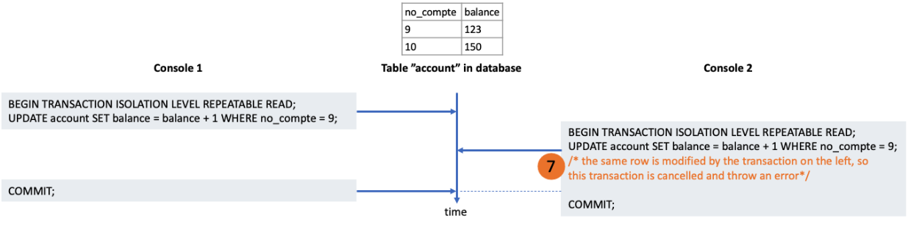
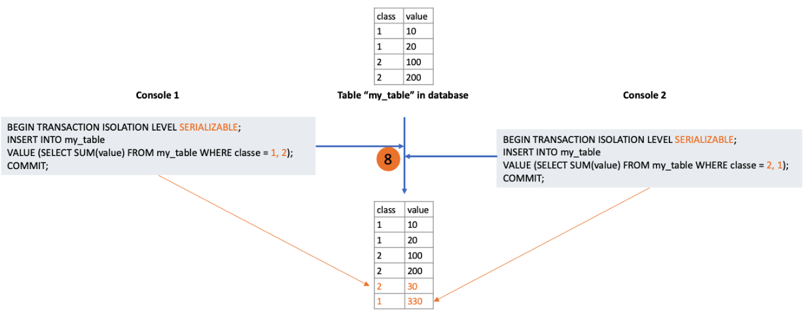
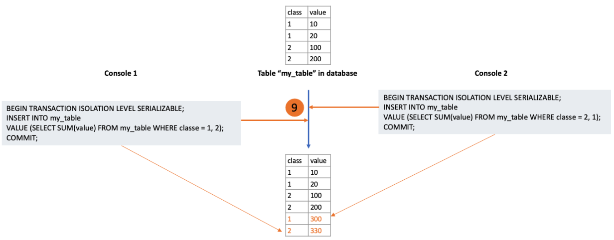

# PostgreSQL isolation transaction

This article illustrates some behaviours of the various transaction isolation settings described in the official PostgreSQL documentation: [https://www.postgresql.org/docs/12/transaction-iso.html](https://www.postgresql.org/docs/12/transaction-iso.html). It is recommended to read it first.

## Reminders
This section contains quick reminders from the PostgreSQL documentation.

A transaction begins with the BEGIN command and is validated by the COMMIT command. Each SQL query is automatically encapsulated in a transaction by PostgreSQL.

The SQL standard describes 4 problems (phenomena) to avoid when executing a transaction:
- **dirty read**: A transaction re-reads data it has previously read and finds that data has been modified by another transaction (that committed since the initial read)
- **nonrepeatable read**: A transaction re-reads data it has previously read and finds that data has been modified by another transaction (that committed since the initial read)
- **phantom read**: A transaction re-executes a query returning a set of rows that satisfy a search condition and finds that the set of rows satisfying the condition has changed due to another recently-committed transaction
- **serialization anomaly**: The result of successfully committing a group of transactions is inconsistent with all possible orderings of running those transactions one at a time

The SQL standard describes 4 transaction isolation modes that will be used to progressively prevent its phenomena (in order of tolerance to the phenomena):
1. Read Uncommited
2. Read commited
3. Repeatable Read
4. Serializable

## Read Uncommited

In PostgreSQL, this isolation mode behaves like "Read Commited".

## Read Commited

This is the default transaction isolation.

In this mode, each request sees all validated data. In the following example, we simulate the concurrent access of two transactions by the use of two consoles in which the commands are executed. So the SELECT query in console 2 ((1)  below) sees 123 (and not 124) because the UPDATE in console 1 has not yet been committed in the other transactions (because COMMIT is executed after SELECT):

The two consoles in which the commands are executed simulate the concurrent access of two transactions.

Thus, in the same transaction, if a second SELECT is executed after the validation of the transaction from console 1, it will see 124. See (2) below. This
behaviour is called **"nonrepeatable read"** and is one of the 4 phenomena that we try to avoid.

This SELECT ((3) below) can see the result of previous query that are in the same transaction (even though they are not committed). Example, the SELECT ((3) below) will return 151.

For the UPDATE, DELETE commands, this behaviour is a little bit different since if the line they update is also modified by another transaction, these commands will wait for the end of this other transaction (either the cancellation or the validation), then use its result. In the example below, the UPDATE of console 2 (4) will see 124 (result of the transaction on the left after the commit) and will return 125.

The same behaviour as UPDATE and DELETE can be obtained with SELECT by adding the FOR UPDATE or FOR SHARE clause. For example:

`SELECT balance FROM account WHERE account_num = 9 FOR UDPATE;` 

will wait for other transactions that concern this row to finish.

When UPDATE is executed (after the wait), its WHERE clause is re-evaluated to make sure it's the same row that it is modifying. If the row no longer matches the WHERE clause, the UPDATE is canceled.

This re-evaluation then cancellation can also cause unexpected behaviour: the phenomenon of **"phantom read"**. For example the following DELETE will not delete any line:

Because, after the transaction in console 1 updates all the lines, the DELETE of console 2 ((5) above) will:
- evaluate its WHERE clause (which only concerns the row of id 2),
- then wait for the first transaction to finish because it modifies this line too.
- reevaluate the WHERE clause only for row of id 2
- the balance of this line no longer checks the WHERE clause so the DELETE is canceled.

## Repeatable Read

Unlike the **"Read Commited"** mode, this mode will only see the data validated before the start of the transaction. Thus, the phenomenon of **"nonrepeatable read"** becomes impossible and the SELECT (6) below returns the same result as the previous SELECT.

The behaviour of UPDATE, DELETE, SELECT FOR UPDATE / SHARE will change: instead of waiting for the result of the concurrent transaction (see (4)), the transaction will be rolled back with the message:
*"ERROR: could not serialize access due to concurrent update" (see (7) below)*

So it will be necessary to implement retry mechanisms when this error occurs.

:::tip To summarise

The differences with "Read Commited" mode are:
- advantage: avoids the **"non repeatable read"** and **"phantom read"** phenomena.
- drawback: requires the implementation of retry.

:::

## Serializable

This mode has the same behaviour as "Repeatable Read", but it will also check that the database modifications are identical even if the execution order of the concurrent transactions is changed.

In the following example:
- the transaction in console 1 sums the values of class 1, then inserts the result with a class 2 (8)
- the transaction in console 2 sums the values of class 2, then inserts the result with a class 1

In this case, PostgreSQL will check if the result is the same by first executing the transaction from console 2 before the transaction from console 1.

Here, the result of the table is not the same after the inversion (9), so the transaction of console 1 will be committed, but the one of console 2 will be rolled back.

:::tip To summarise

The differences with "Repeatable Read" mode are:
- advantage: avoids the "serialization anomaly" phenomenon.
- disadvantage: is more expensive in computation than the two other modes (except if one abuses the explicit locks FOR UPDATE / SHARE).

:::