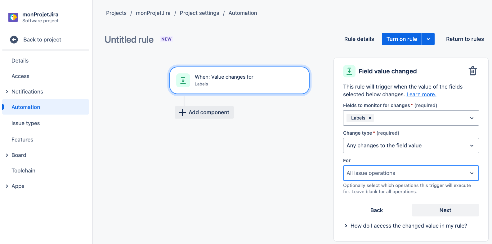
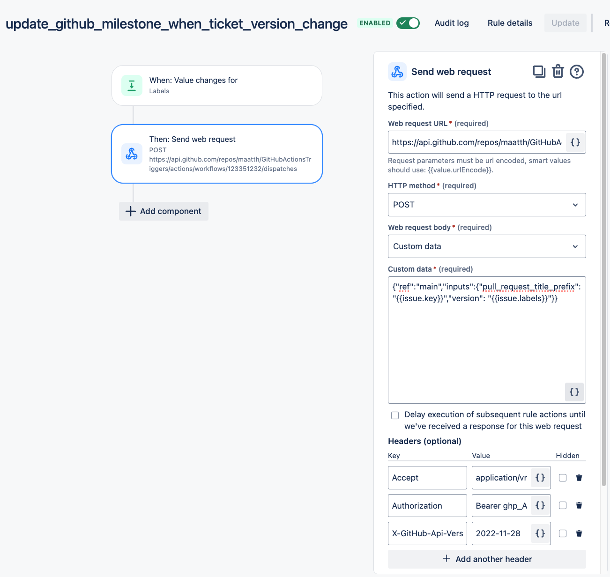

# Contexte
Imaginons un ticket Jira et une pull request associée. Normalement, la version du ticket Jira et le milestone de la PR doivent correspondre. Mais très souvent, on change la version du ticket Jira sans mettre à jour le milestone. 
# But
Cette article explique comment synchroniser automatiquement la version et le milestone de la PR correspondante. 
La synchronisation doit se lancer uniquement en cas de modification de la version (donc pas de cron) et doit être la plus économique possible. 
# Solution
Un script de synchronisation s'executera sur un runner GitHub car gratuit, sous forme de workflow GitHub actions exploitant l'API Github pour modifier la PR. Le déclencheur sera un Jira automation, car il permet des scénarios complexe comme de faire un appel HTTP lorsqu'un champ spécifique d'un ticket est modifié.
Nous prendrons comme exemple une version et un milestone qui sont différents (respectivement API-V0.0.1 et v0.0.1).

## 1 - Créer un workflow github action

```
name: Update pull request milestone from Jira issue version
 
on:
  # workflow_dispatch allows to run this workflow manually from the Actions tab
  workflow_dispatch:
    inputs:
      pull_request_title_prefix:
        description: 'Specify the pull request key prefix (ex: CE-4001)'
        required: true
      version:
        description: 'Specify the Jira ticket version to update (ex: API-V0.0.2)'
        required: true
 
permissions:
  contents: write
  pull-requests: write
 
jobs:
  build:
    runs-on: ubuntu-latest
 
    steps:
      - uses: actions/checkout@v4
 
      - name: Inputs displays
        run: |
          echo "::notice title=Workflow ran with these inputs: :: pull_request_title_prefix=${{ github.event.inputs.pull_request_title_prefix }} and version=${{ github.event.inputs.version }}"
 
      - name: 'Convert version to milestone label (ex: API-V0.0.2 -> v0.0.2)'
        run: |
          milestone_label="v$(echo "${{ github.event.inputs.version }}" | sed 's/[^0-9.]//g')"
 
          echo "milestone_label=$milestone_label" >> $GITHUB_ENV
 
          echo -e "\033[1;32m...  ✅ milestone_label=$milestone_label\033[0m"
 
      - name: 'Getting milestone number from milestone label (ex: v0.0.2 -> 1)'
        run: |
          milestone_number=$(\
          curl --silent -L \
          -H "Accept: application/vnd.github+json" \
          -H "Authorization: Bearer ${{ secrets.GITHUB_TOKEN }}" \
          -H "X-GitHub-Api-Version: 2022-11-28" \
          https://api.github.com/repos/Next-Interactive/cleo-opta-feed-api/milestones \
          | jq --arg milestone_label "$milestone_label" '.[] | select(.title == $milestone_label).number')
 
          # Check if milestone_number is empty
          if [ -z "$milestone_number" ]; then
            echo -e "\033[1;31m...  ❌ Milestone not found.\033[0m"
            exit 1
          fi
 
          echo "milestone_number=$milestone_number" >> $GITHUB_ENV
 
          echo -e "\033[1;32m...  ✅ milestone_number=$milestone_number\033[0m"
 
      - name: 'Get last open pull request number from pull request title prefix (ex: CE-4001 -> 1)'
        run: |
          pull_request_number=$(curl --silent -L \
          -H "Accept: application/vnd.github+json" \
          -H "Authorization: Bearer ${{ secrets.GITHUB_TOKEN }}" \
          -H "X-GitHub-Api-Version: 2022-11-28" \
          "https://api.github.com/repos/Next-Interactive/cleo-opta-feed-api/pulls?state=open&sort=created&direction=desc" \
          | jq --arg title_prefix "${{ github.event.inputs.pull_request_title_prefix }}" '.[] | select(.title | contains($title_prefix)).number' | head -n 1);
 
          # Check if pull_request_number is empty
          if [ -z "$pull_request_number" ]; then
            echo -e "\033[1;31m...  ❌ Pull request not found.\033[0m"
            exit 1
          fi
 
          echo "pull_request_number=$pull_request_number" >> $GITHUB_ENV
 
          echo -e "\033[1;32m...  ✅ pull_request_number=$pull_request_number\033[0m"
 
      - name: 'Modify the milestone of the pull request'
        run: |
          curl --silent -L \
          -H "Accept: application/vnd.github+json" \
          -H "Authorization: Bearer ${{ secrets.GITHUB_TOKEN }}" \
          -H "X-GitHub-Api-Version: 2022-11-28" \
          -X PATCH \
          -d "{\"milestone\": \"$milestone_number\"}" \
          https://api.github.com/repos/Next-Interactive/cleo-opta-feed-api/issues/$pull_request_number;  # Have to use '/issues/' instead of '/pulls/'
 
          echo -e "\033[1;32m...  ✅ pull request milestone updated\033[0m"
```


## 2- tester le manuellement :
Dans l'onglet "Actions", sélectionner le workflow à gauche puis cliquer sur "Run workflow" à droite :


Pour apparaitre à gauche, le script doit être dans la branche principale (main ou master).

## 3- Récupérer l'id du workflow
 
Nous aurons besoin de l'id du workflow pour créer notre Jira Automation.
Dans un terminal, faire cette appel Curl (après avoir remplacé le token github par le votre) :

	```bash 
	curl -L -H "Accept: application/vnd.github+json"  -H "Authorization: Bearer ghp_Azff......EnJ" -H "X-GitHub-Api-Version: 2022-11-28" https://api.github.com/repos/maatth/GitHubActionsTriggers/actions/workflows
	```

Vous récupererez la liste des workflows correspondant, à partir de laquelle vous pourrez extraire l'id de notre workflow : 
```JSON
{
  "total_count": 1,
  "workflows": [
    {
      "id": 123351232, <--- ceci
   ...
}
```


## 4- Créer l'automation Jira

Dans un projet Jira, aller sur 'Automation' then 'create rule':
https://maatthieujira.atlassian.net/jira/software/projects/SCRUM/settings/automation#/rule/new/__NEW__TRIGGER 

Pour la 1ère étape, choisir "Field Value changed" et remplir les champs selon vos besoin:



Puis cliquer sur 'add component' et remplissez le champs suivants : 

**Web request URL** : https://api.github.com/repos/maatth/GitHubActionsTriggers/actions/workflows/123351232/dispatches
**HTTP method:** POST
**Web request body**: Custom data
**Custom data** : 
```JSON
{
    "ref": "main",  <-- main ou master
    "inputs": {
        "pull_request_title_prefix": "{{issue.key}}",
        "version": "{{issue.labels}}"
    }
}
```


vous pouvez adaptez à vos besoin en sachant que vous pouvez utiliser l'API Jira pour récupérer les noms des fields : 
https://maatthieu.atlassian.net/rest/api/2/issue/KAN-1?expand=names

Dans la partie headers:
**Accept :** application/vnd.github+json
**Authorization:** Bearer ghp_Az4...
**X-GitHub-Api-Version:** 2022-11-28


 
Cliquer sur suivant, activé la rules et donner lui un nom.

Astuce : 
Pour executer un workflow github actions avec un appel Curl :
```
curl -L -X POST -H "Accept: application/vnd.github+json" -H "Authorization: Bearer <your_token>" -H "X-GitHub-Api-Version: 2022-11-28" https://api.github.com/repos/maatth/GitHubActionsTriggers/actions/workflows/123351232/dispatches -d '{"ref":"main","inputs":{"pull_request_title_prefix":"SCRUM-1","version":"API-V0.0.2"}}'
```

Ressources : 
https://github.com/Mudlet/Mudlet/blob/development/.github/workflows/tag-pull-requests.yml
https://github.com/orgs/community/discussions/25724
https://github.com/n8ebel/GitHubActionsAutomationSandbox/blob/main/.github/workflows/workflow_dispatch_example.yml
https://docs.github.com/en/rest/issues/milestones?apiVersion=2022-11-28
https://docs.github.com/en/rest?apiVersion=2022-11-28
https://goobar.dev/manually-trigger-a-github-actions-workflow/
