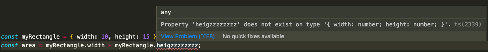
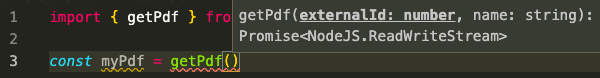
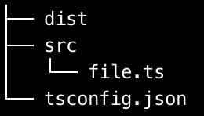

# TypeScript integration study

**TL;DR**: Yes it’s possible to use it everywhere ! 🥳 Typescript is the addition of typing to Javascript. So it can be used wherever Javascript is, with the same flexibility but adapted for large projects. Its slogan:
**"Typescript ”JavaScript that scales.””**


This article introduces TypeScript, its pros and cons and describe how to configure it in existing JavaScript project.
- Introduction
- Typing
	- Union
	- Optional Inference Compilation
- Pros and Cons 
	- Short-terms pros
	- Long-terms pros
	- Cons
- Minimal configuration of a bare-bone full TypeScript
- Migration of a large project in production Babel configuration
	- TypeScript installation
	- ESLint configuration
	- Webpack configuration
	- Start converting JavaScript code to Typescript
- Conclusion


# Introduction
TypeScript was invented 10 years ago by Anders Hejlsberg. He was already the architect of **Turbo Pascal, Delphi then DotNet / C # at Microsoft**.

Its purpose is to complete JavaScript by improving its **robustness** while keeping an almost **identical** syntax, **flexibility** and **compatibility** with existing JavaScript projects.

To do this, it adds, among other things, the classic functionalities of object-oriented languages (typing, class, inheritance, abstraction, method overriding, member visibility), which makes it more suitable for **large projects**, while allowing several programming styles (functional , object- oriented, etc.).

Finally, thanks to its **transpiler** (program which will convert its code into JavaScript), that TypeScript can be used in any project requiring JavaScript (front, back, mobile).

# Typing
Among all TypeScript features, only **typing** is required. Typing is specifying inside the code the form of the data of each: 

``` js
let myName: string
function arguments and return: function sayHi (name: string): string {return `Hi $ {name}`}
```

There are  [13 types](https://www.typescriptlang.org/docs/handbook/basic-types.html) provided by TypeScript. The most used are: `string`, `number`, `boolean`, `array`, `tuple`, `enum`, `any` and `void`, where any is a wildcard that can replace any other type. void is used when the function returns nothing. The other types are rarely use: `unknown`, `null`, `undefined`, `never` and `object`.
These 13 types are called "basics" types. They can be used to build custom types: type or [interface](https://www.typescriptlang.org/docs/handbook/2/everyday-types.html#interfaces) (the main difference between type and interface is that the interface can extend another interface):

```ts
type Human = {
  name: string;
  age: number; 

};
```

Then it is used like this:

```ts
const myPerson: Human = {name: 'George', age: 30};
```


which is equivalent to:

```ts
const myPerson: {name: string; age: number;} = {name: 'George', age:
30};
```

But it is recommended to write the types/interfaces in external file for better reusability. This file is called a [declaration file](https://www.typescriptlang.org/docs/handbook/declaration-files/introduction.html) whose extension is "**.d. ts**".


## Union
Sometimes the person can be an alien 🙃. TypeScript can be told that the type can be Human or an Alien with the operator “|”. This is called an **union** type:

```ts
const myLivingEntity: Person | Alien = {name: 'George', age: 30};
```

where `Alien` will be a totally different type from the Person type.


## Optional
Sometimes, we do not know the name of the person. So the property name of a custom type can be [optional](https://www.typescriptlang.org/docs/handbook/interfaces.html#optional-properties) (with “?” operator):

```ts
 type Person = {
  name?: string;
  age: number; 

};
```

Then we can **omit** to set the name property:
```ts
const myPerson: Person = {age: 30};
```


## Inference
It is not necessary to specify all types, Typescript can infer them most of the time. It’s called Type inference. In this example :

```ts
const age = 34; // instead of const age: number = 34;
```

TypeScript can guess age has the type number without setting explicitly.


## Compilation
TypeScript comes with its compiler, that will convert its code into JavaScript one.
1. Install TypeScript with this command:
`yarn add typescript --dev`

2. Compile with this command:
`yarn tsc test.ts`
where “test.ts” is the TypeScript file you want to convert.


# Pros and Cons

## Short-terms pros
Typing helps the IDE understand the code. So, it will:

- points out potential inconsistencies in real time:


- allow automatic imports:


- allow efficient autocompletion so developer write code faster with less errors:





## Long-terms pros
- **Solid** fundamentals (author experienced)
- **Long-term** support thanks to Microsoft
- **Popularity** constantly increasing. It can be seen by the increasing [number of stars](https://madnight.github.io/githut/#/stars/2021/1%20) on TypeScript projects on Github
- Developers **love** it 🥰 (cf. [Stackoverflow survey](https://insights.stackoverflow.com/survey/2020#technology-most-loved-dreaded-and-wanted-languages-loved))
- Companies that try Typescript don’t switch back: so the number of TypeScript project increases as well the Typescript developers. This eases **future recruitment**.


## Cons
- Development is **slowed down** by the typing, but since custom types are reusable, this slowdown is less and less noticeable.
- TypeScript requires a **period of learning**, although the syntax is almost the same (Typescript even implements features in advance provided in the ECMAScript roadmap).
- The code needs to be **converted into Javascript before each execution**: this is already the case with Babel or Webpack.
- The **external libraries are not in TypeScript**: famous libraries are more and more written in TypeScript and for the rest of them a declaration file is included or exists on Microsoft the @Typed repository.
- Typing syntax is sometimes **difficult to read** (especially [generics](https://www.typescriptlang.org/docs/handbook/2/generics.html), which is used instead of any, but for type that will not vary). For example (extracted from Featherjs lib):
```ts
type Hook <T = any, S = Service <T>> = (context: HookContext <T, S>) =>
(Promise <HookContext <T, S> | void> | HookContext <T, S> | void);
```


# Minimal configuration of a bare-bone full TypeScript
Let’s say you already have a freshly new Javascript project with Node and Express installed, with the following arborescence:
![[arbo.png]]

where:
- “**dist**” is a folder that will contains converted TypeScript code
- “**src**” folder will contain all your TypeScript code

This section will show the basic (and most important) set up of TypeScript with a minimal configuration:
1. Add Typescript as a development dependency:
`yarn add typescript --dev`

2. Create the TypeScript configuration file (tsconfig.json) at the root of your project :
`yarn tsc --init`

3. Modify the following lines:
```json
{
	"compilerOptions": { 
		"outDir": "dist", // <- destination folder of all converted TypeScript files 
		"target": "ES5", // <- Javascript version of generated files 
		"strict": true // <- force the dev to specify the type that Typescript can't infer + force the dev to specify if a variable can be null 
	},
	"include": ["src/**/*"]  // <- ".ts" files (Typescript) that match this path will be converted (here: file.ts)
}
```

4. Optional: install the external library declaration files:
For each external library, TypeScript need a [declaration file](https://www.typescriptlang.org/docs/handbook/declaration-files/introduction.html) (with extension ".d.ts").
- Most of the time, this file is directly included in the library with the name "index.d.ts" file. It’s called a "**bundled**" library.
- If this file does not exist, it can be found on the Internet, generally inside a huge Github repository : [@DefinitelyTyped](https://github.com/DefinitelyTyped/DefinitelyTyped). This repo is managed by microsoft but fed by everyone. This file is added like any dev dependency package installation. In this project, we need to add **node** and **express** declaration file: `yarn add --dev @types/node @types/express`
- Finally, if this declaration file is neither included in the library, nor in the [@DefinitelyTyped](https://github.com/DefinitelyTyped/DefinitelyTyped) repo, then we must create it. It can be created **manually** (for ex: declarations.d.ts) or with the **help of the compiler**. Add the following options to the tsconfig.json file and then compile the project by executing the command at project’s root: `tsc`
```json
//tsconfig.json
"compilerOptions": {
	"declaration": true,
    "emitDeclarationOnly": true,
    "noEmit": false
}
```


# Migration of a large project in production
Converting all existing code at once into Typescript is a **cumbersome operation**. Thus, to avoid a tunnel effect, regressions and facilitate the adoption of this new language by developers, a **gradual migration is recommended**. It consists in making JavaScript and Typescript coexist in the same project. In other words, the JavaScript code must be able to call Typescript code and vice versa. So the severity of the Typescript transpiler should be **lowered** in order to accept not typed Javascript code, while retaining as much type-check as possible.

In addition, tools like **Babel, Webpack, ESLint** or **Nodemon** are often used. It is therefore necessary to modify their configuration to make them compatible with Typescript and vice versa.

## Babel configuration
The TypeScript compiler converts **only** Typescript, not JavaScript. So Babel (or any other version transpiler) remains **mandatory**. So for example, we could first convert the TypeScript code into JavaScript ES6, then convert again all the code (the freshly converted one + the JavaScript already existing) into ES5:

Typescript  - - - - (Ts compiler)  - - - > Javascript ES6 - - - - (Babel) - - - -> Javascript ES5
 
But this double conversion heavy so TypeScript recommends instead to use a Babel plugin which will convert everything at once: @babel/preset- typescript.

But this double conversion heavy so TypeScript recommends instead to use a Babel plugin which will convert everything at once: [@babel/preset- typescript](https://babeljs.io/docs/en/babel-preset-typescript).

❗️ The downside is that there will be no type-checking during this conversion.

To support the latest Typescript features, we will also install two other plugins:
- @babel/plugin-proposal-object-rest-spread
- @babel/plugin-proposal-class-properties

If Babel 7 is already installed, use the following command to install these plugins:

`yarn add --dev @babel/preset-typescript @babel/plugin-proposal-class-properties @babel/plugin-proposal-object-rest-spread`

then modify the Babel configuration file to includes these plugins:
```js
//.babelrc.js
module.exports = {
	presets: [
	    ['@babel/preset-env', { targets: { node: 'current' } }],
		'@babel/preset-typescript'   // order is important: Babel read from right to left
	],
	plugins: [
	    "@babel/plugin-proposal-class-properties",
	    "@babel/plugin-proposal-object-rest-spread",
	]
};
```

Strangely, **Babel only reads the JS files by default**, it needs to add the extensions --extensions \". ts,.js" to all Babel commands, ex:
```json
// package.json
"scripts": { 
	"build": "babel src -d dist --extensions \".ts,.js\"",
    "start:dev": "heroku local -f Procfile.localdev",
    "lint": "eslint src test --cache",
    "test": "ava",
	"test:dev": "heroku local:run ava"
},
```
or:
```
// Procfile.localdev
web:    babel-watch src/app.js --extensions ".ts,.js"
worker: babel-watch src/app.js --extensions ".ts,.js"
```

## TypeScript installation
1. As described previously, install TypeScript as dev dependency:
`yarn add typescript --dev`

2. Create the TypeScript configuration file:
`yarn tsc --init`
%%
Note : if you got the following error : “gyp: No Xcode or CLT version detected (source)”, execute this command: sudo xcode-select --reset
%%

3. Modify the following lines in the tsconfig.json file as follows (more details here):
```json
{
	"compilerOptions": {
		"target": "esnext",  		// <- ECMAScript de destination. So, during the compilation, the TypeScript plugin will be responsible for recognizing the Typescript code and deleting it, leaving Babel only JavaScript that it can handle
		"module": "commonjs", 		// <- search under node_modules for non-relative imports.
		"moduleResolution": "node", // <- process & infer types from .js files.
		"allowJs": true, 			// <- replaces the need of declaration file for existing JavaScript code, since ts will try to understand js files
		"noEmit": true, 			// <- no code will be converted because ESLint will handle it
		"strict": true, 			// <- enable strictest settings like strictNullChecks & noImplicitAny
		"moduleResolution": "node", // <- specify module resolution strategy: 'node' (Node.js) or 'classic' (TypeScript pre-1.6). */
		"isolatedModules": true, 	// <- disallow features that require cross-file information for emit.
		"esModuleInterop": true, 	// <- import non-ES modules as default imports.
	},
	"include": ["./src/**/*"]
}
```

## ESLint configuration
1. Install the following plugins with this command: 
`yarn add --dev @typescript-eslint/parser @typescript-eslint/eslint-plugin`
where:
•	@typescript-eslint/parser is used to parse TypeScript code to be linted
•	@typescript-eslint/eslint-plugin will contains some standard linting rules for TypeScript code

2. Modify “package.json” file:
By default, ESLint does not read tsconfig.json, it has its own rules with the plugin [@typescript-eslint/recommended](https://github.com/typescript-eslint/typescript-eslint/blob/main/packages/eslint-plugin/src/configs/eslint-recommended.ts) . In addition, it does not do type checking (except it is asked with the plugin [@typescript-eslint/recommended-requiring-type-checking](https://github.com/typescript-eslint/typescript-eslint/blob/main/packages/eslint-plugin/src/configs/recommended-requiring-type-checking.ts)), hence the addition of tsc command in package.json:

```json
"scripts": {
    "build": "babel src -d dist --extensions \".ts,.js\"",
    "start:dev": "heroku local -f Procfile.localdev",
    "lint": "tsc && eslint src test --cache",  // <- here
    "check-types": "tsc",  // <- here
    "test": "ava",
    "test:dev": "heroku local:run ava"
},
```

%%
Despite Typescript compiler check also the typing, it is as fast as Babel. If it is still too slow, an incremental compilation can be activated.
%%

3. Modify the ESLint configuration file.
ESLint must be authorized to see the Typescript files and apply specific rules (overrides) to them.

```js
// eslintrc.js
module.exports = {
  extends: ['gowento'],
  settings: {
    'import/resolver': {
      node: {
        extensions: ['.js', '.ts'], // let eslint see ts files -> no unresolved path error
      },
    },
  },
  rules: {
    'import/extensions': [
      'error',
      'ignorePackages',
      {
        ts: 'never', // no need to use extensions when import external file ('Missing file extension "ts"' error)
        js: 'never', // we override airbnb rules here
      },
    ],
  },
  overrides: [
    {
      files: ['*.ts'],
      parser: '@typescript-eslint/parser',
      plugins: ['@typescript-eslint'],
      extends: ['plugin:@typescript-eslint/recommended', 'plugin:prettier/recommended'],
      parserOptions: {
        ecmaversion: 2018,
        sourceType: 'module',
      },

      /**
       * Typescript Rules
       */
      rules: {
        '@typescript-eslint/no-explicit-any': 2, //   Severity should be one of the following: 0 = off, 1 = warn, 2 = error
      },
    },
  ],
};
```

## Webpack configuration
TODO

## Start converting JavaScript code to Typescript
Now our configuration allows us to type everything as "any" (no-implicit-any: false). In addition, external JavaScript files as well as libraries are accepted by Typescript (allowJs: true). We can therefore start writing / converting TypeScript code that will integrate with existing JavaScript code.

%%
A [interesting tool](https://github.com/airbnb/ts-migrate) made by Airbnb can convert all Javascript code into TypeScript.
%%

As seen above, it is a good practice to outsource typing in one or more declaration files. We can place these files either:
- right next to the js file,
- grouped into a single file at the root
- in an architectured folder at the root
- a mix that depends on the scope (my choice)

Finally, we can install the declaration files of libraries that do not have any (see [@DefinitelyTyped](https://github.com/DefinitelyTyped/DefinitelyTyped))

%%
To prevent TypeScript checking: // @ts-ignore ou // @ts-nocheck
 %%
# Conclusion
Starting by converting a **small part of code** into Typescript is a good way to **get used** with it and to build a **solid opinion**. But keep in mind that there will be a **painful period** at the beginning with a feeling of being forced, slowed down, spending too much time understanding the new Typescript alerts ☹️. This should normally change to a feeling of **speed, serenity and comfort** 😀 !

In the future, when all JavaScript will be converted in TypeScript, Babel will not be necessary anymore. It will possible to increase the strictness of the compiler by activating the option `noImplicitAny` in “tsconfig.json” file.

Sources: 
•	Official documentation: [https://www.typescriptlang.org]([https://www.typescriptlang.org](https://www.typescriptlang.org)) 
•	Configure Babel 7 and TypeScript : [https://devblogs.microsoft.com/typescript/typescript-and-babel-7/]([https://devblogs.microsoft.com/typescript/typescript-and-babel-7/](https://devblogs.microsoft.com/typescript/typescript-and-babel-7/))
•	Official doc for Babel and TypeScript : [https://www.typescriptlang.org/docs/handbook/babel-with-typescript.html](https://www.typescriptlang.org/docs/handbook/babel-with-typescript.html)
•	Create interface from a JSON : [https://app.quicktype.io/#l=ts](https://app.quicktype.io/#l=ts )
•	Migrate from JavaScript to TypeScript : [https://www.typescriptlang.org/docs/handbook/migrating-from-javascript.html](https://www.typescriptlang.org/docs/handbook/migrating-from-javascript.html)